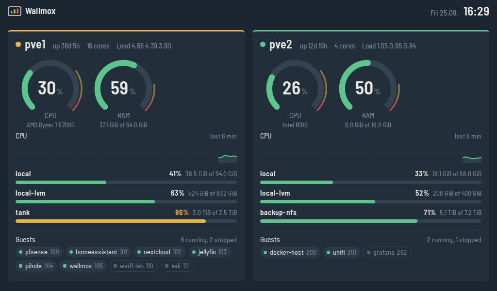
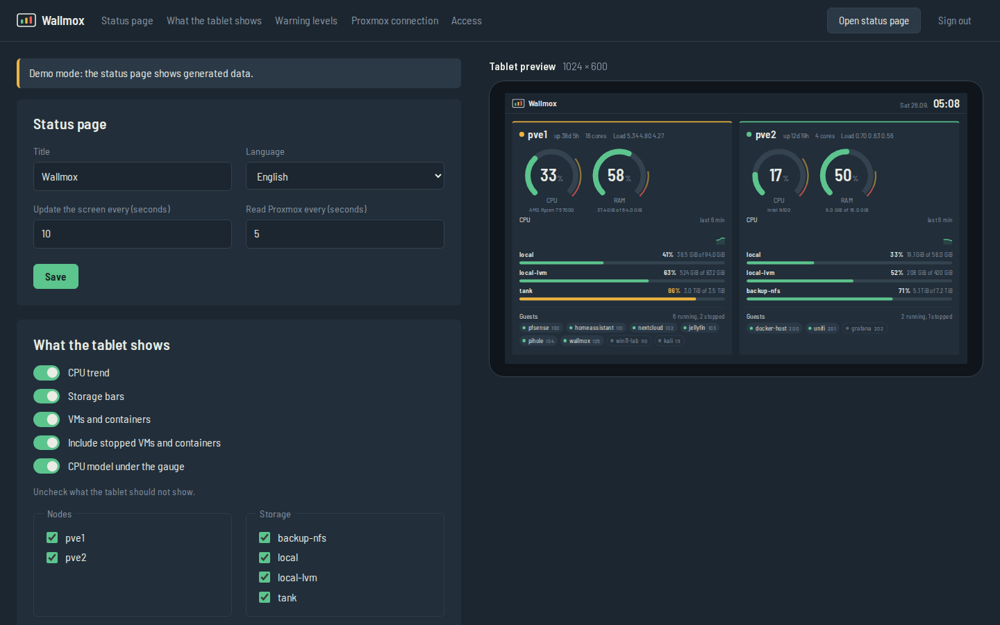

# Wallmox

Turn an old tablet into a wall-mounted Proxmox status dashboard.

Wallmox runs in a small LXC container, reads your Proxmox VE nodes through a
read-only API token and serves a lightweight status page that works even on
Android 4.4 browsers.



## What it shows

- CPU and RAM gauges per node, with amber and red zones at your thresholds
- CPU trend for the last few minutes
- Usage of every active storage
- VMs and containers, running ones first
- A banner when Proxmox stops answering, so old numbers never pass as current

Everything is set up in an admin panel on the same address, including a live
preview of the tablet screen.



## Install

Open the **Shell** of a Proxmox node and run:

```bash
bash -c "$(curl -fsSL https://raw.githubusercontent.com/krajcara/wallmox/main/install.sh)"
```

The installer:

1. asks a few questions (every one has a default, so Enter is enough),
2. downloads the latest Debian template,
3. creates the user `wallmox@pve` with the read-only role **PVEAuditor** and an API token,
4. creates an unprivileged container (1 core, 512 MB RAM, 4 GB disk),
5. installs Wallmox in it and starts the service,
6. prints the status page address, the admin panel address and the admin password.

Wallmox never gets write access to Proxmox, and nothing is installed on the node itself.

## Try it without Proxmox

```bash
git clone https://github.com/krajcara/wallmox.git && cd wallmox
python3 -m venv venv && venv/bin/pip install -r requirements.txt
venv/bin/python -m wallmox --demo
```

Open `http://<your-ip>:8080/status`. For the admin panel, set a password first
with `venv/bin/python -m wallmox set-password`.

## Admin panel

Open `http://<container-ip>:8080/admin`. There you can:

- change the title, language and refresh intervals,
- choose what the tablet shows, and hide single nodes or storages,
- set the amber and red warning levels,
- change and test the Proxmox connection,
- protect the status page with a key, and set the reverse proxy option,
- change the admin password.

Forgot the password? In the container run:

```bash
runuser -u wallmox -- /opt/wallmox/venv/bin/python -m wallmox set-password
```

## Upgrading from 0.1

In the Wallmox container:

```bash
cd /opt/wallmox && git pull
bash scripts/setup-container.sh
runuser -u wallmox -- /opt/wallmox/venv/bin/python -m wallmox set-password
systemctl restart wallmox
```

Your `config.toml` keeps working. Once you save something in the admin panel,
its settings take precedence over the file.

## Manual install

If you prefer not to run the installer, create a token on the node:

```bash
pveum user add wallmox@pve --comment "Wallmox dashboard (read-only)"
pveum acl modify / --users wallmox@pve --roles PVEAuditor
pveum user token add wallmox@pve dash --privsep 0
```

Then in a Debian 12 or 13 container:

```bash
apt update && apt install -y git python3 python3-venv
git clone https://github.com/krajcara/wallmox.git /opt/wallmox
bash /opt/wallmox/scripts/setup-container.sh
nano /etc/wallmox/config.toml     # host, token_id, token_secret
runuser -u wallmox -- /opt/wallmox/venv/bin/python -m wallmox set-password
systemctl start wallmox
```

## Behind a reverse proxy

Wallmox serves plain HTTP on port 8080. For HTTPS, put it behind Nginx Proxy
Manager, Caddy or Traefik, forward to `http://<container-ip>:8080`, and turn on
**Wallmox is behind a reverse proxy** in the admin panel. Keep the admin panel
reachable only from your own network.

## Setting up the tablet

- Use a browser that still supports your Android version. For Android 4.4 that
  is Chrome up to version 81 or Firefox up to version 68. The built-in browser
  also works.
- Open `http://<container-ip>:8080/status` and add it to the home screen.
- Keep the screen on: enable Developer options, then **Stay awake** (screen
  stays on while charging).
- A tablet that is always plugged in can develop a swollen battery. Check it
  from time to time.

## Files

| Path | What it is |
|---|---|
| `/etc/wallmox/config.toml` | Starting values written by the installer |
| `/var/lib/wallmox/settings.json` | Everything saved in the admin panel (wins over the TOML file) |
| `/opt/wallmox` | The app |

Logs: `journalctl -u wallmox -f`.

## Browser compatibility

The status page is written for old browsers on purpose: plain ES5 JavaScript,
flexbox without `gap`, no CSS variables or grid, server-drawn SVG, and a
bundled font (Barlow Semi Condensed, SIL OFL). Please keep it that way in pull
requests.

## Roadmap

- ~~**0.2** Installer run from the Proxmox host shell, admin panel for settings~~
- **0.3** Temperatures through a small agent on each node, longer history
- **0.4** Updates from the admin panel with rollback
- **1.0** Multi-node and cluster polish, documentation

## Development

```bash
pip install -r requirements.txt pytest
python -m pytest
WALLMOX_DATA=./data python -m wallmox set-password
WALLMOX_DATA=./data python -m wallmox --demo
```

## License

MIT. The bundled font is licensed under the SIL Open Font License
(`wallmox/static/fonts/OFL.txt`).
